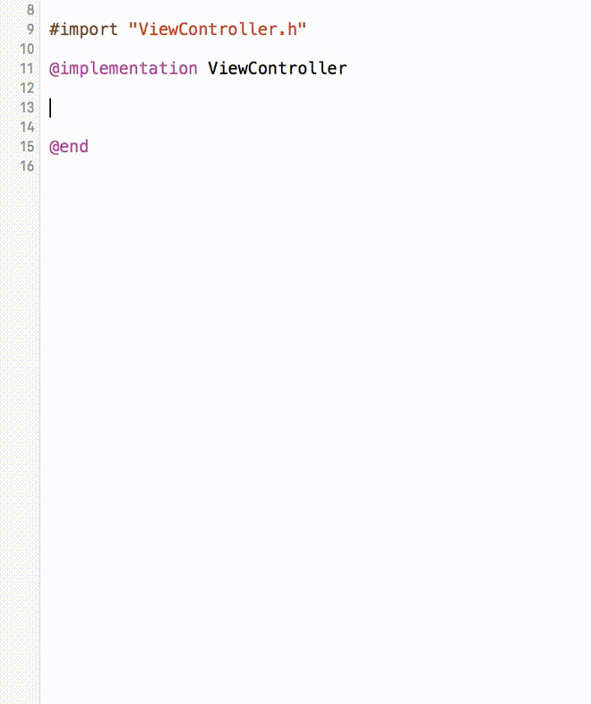

BodyBuilder
===========

Xcode Plugin for creating initial versions of method bodies.

Install
-------

Install `BodyBuilder` with [Alcatraz Package Manager](http://alcatraz.io/).

Usage
-----

1. Write the first line of your method
2. Go to `Edit > BodyBuilder` or <kbd>^</kbd><kbd>⇧</kbd><kbd>B</kbd>
3. The body was built

